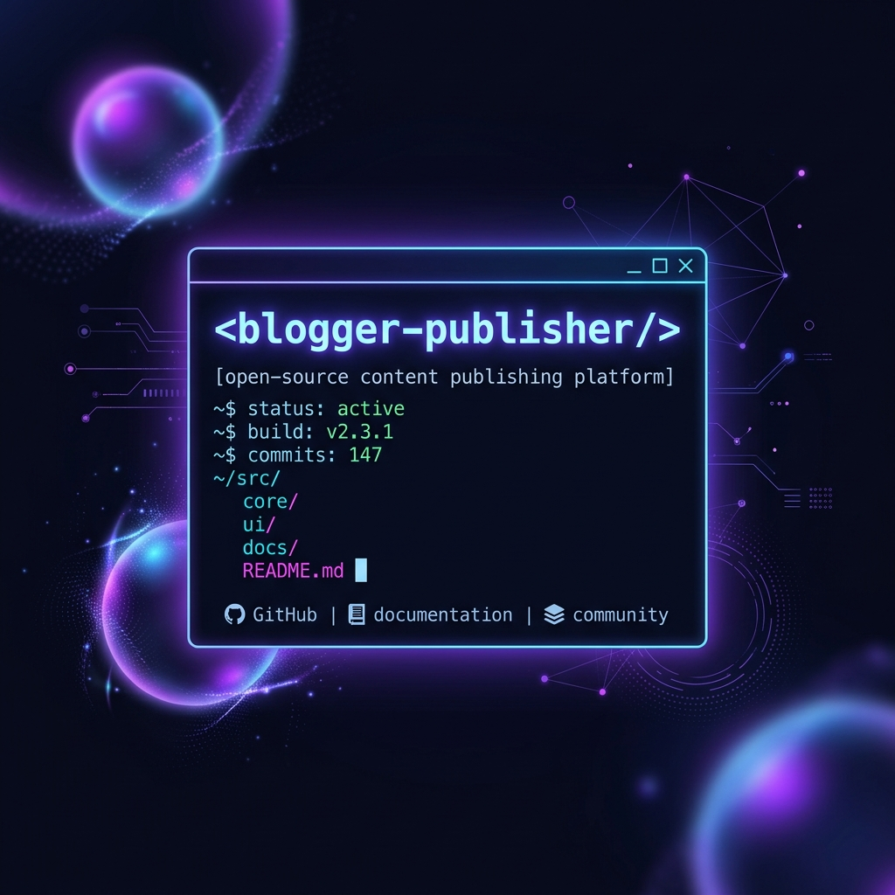

<div align="center">
  
  
  # 🚀 Blogger Publisher CLI
  <p><b>Markdown to Blogger API Automation</b></p>
</div>

Sebuah *tool automation* open-source berbasis Node.js yang memungkinkan Anda (atau Agen AI Anda) untuk mem-publish artikel secara massal (*bulk publish*) dari format Markdown (`.md`) ke Google Blogger, lengkap dengan dukungan *SEO*, upload gambar lokal otomatis, penjadwalan, dan sinkronisasi pintar!

Sangat cocok digunakan sebagai penghubung (*bridge*) jika Anda memiliki AI yang me-generate artikel dan ingin secara otomatis mem-postingnya ke blog Anda secara mandiri. Untuk integrasi AI, lihat [Panduan AI Agent (AGENT.md)](AGENT.md).

## 🚀 Quick Start (Interactive Mode)

Cara paling mudah dan modern untuk memulai proyek autoblog Anda adalah menggunakan **Interactive TUI**:

```bash
# Buat folder kosong untuk proyek blog Anda
mkdir my-blog && cd my-blog

# Jalankan Blogger Publisher dalam mode interaktif
npx blogger-publisher
# ATAU jika sudah di-install global:
blogger-publisher
```

**Sistem akan menampilkan menu interaktif:**
- **🏗️ Init Workspace**: Otomatis memandu Anda mengisi kredensial (`.env`), membuat kerangka folder (`articles/`, `images/`), menulis contoh Markdown perdana, dan memasukkan Instruksi Agen AI (`AGENT.md`).
- **🔑 Auth**: Login OAuth ke Google dengan 1x klik.
- **🚀 Publish**: Mendorong semua artikel Anda ke awan.
- **📥 Pull**: Menyedot artikel lama Anda ke lokal.

---

## 🛠️ Penggunaan Lanjut (Manual/CI/CD)

Untuk Anda yang ingin menggunakan *Cron Job*, GitHub Actions, atau skrip otomatis, Anda tetap bisa melewati menu interaktif dengan menggunakan argumen bawaan:

## ✨ Fitur Utama
- **NPM Global CLI**: Cukup ketik `blogger-publisher publish` dari mana saja!
- **Multi-CDN Image Upload**: Mengubah gambar lokal secara otomatis menjadi tautan publik. Anda bebas memilih provider **Google Drive** (Default), **ImgBB**, **Cloudinary**, atau **GitHub** untuk menahan trafik jutaan pengunjung!
- **Advanced SEO & Custom Slug**: Atur Meta Description dan permalink (URL) khusus yang tidak harus sama dengan judul artikel.
- **Smart Hashing (Anti Duplikasi)**: Script sangat hemat kuota API. Ia tidak akan melakukan pembaruan jika isi teks `.md` tidak mengalami perubahan.
- **Scheduling**: Atur tanggal `date` di masa depan untuk menjadwalkan penayangan (Blogger akan merilisnya secara otomatis).

## 🚀 Instalasi

1. Clone repository ini:
   ```bash
   git clone https://github.com/irfnrdh/blogger-publisher.git
   cd blogger-publisher
   ```
2. Install dependencies:
   ```bash
   npm install
   ```
3. Jadikan sebagai CLI Global:
   ```bash
   npm link
   ```
4. Copy konfigurasi `.env`:
   ```bash
   cp .env.example .env
   ```

## ⚙️ Persiapan Google Cloud (Kredensial)
1. Buka [Google Cloud Console](https://console.cloud.google.com/).
2. Buat Project baru dan aktifkan **Blogger API v3** DAN **Google Drive API**.
3. Buat Kredensial baru -> **OAuth 2.0 Client IDs** (Tipe: Web application).
4. Tambahkan `http://localhost:3030/oauth2callback` di bagian **Authorized redirect URIs**.
5. Simpan dan salin **Client ID** serta **Client Secret** Anda ke `.env`. Masukkan juga **Blog ID** Anda (dari URL dashboard Blogger Anda).

## 🔑 Autentikasi CLI
Untuk membuat alat ini berjalan selamanya, lakukan otorisasi:
```bash
blogger-publisher auth
```
Klik tautan yang muncul di terminal, beri izin akses ke Blogger dan Drive, lalu salin **Refresh Token** yang didapat ke dalam file `.env`.

## 📖 Cara Menggunakan
Buat file Markdown (`.md`) di dalam folder `articles/` dengan format *Frontmatter* di bagian paling atas:
```yaml
---
title: "Artikel Buatan AI (Menarik)"
slug: "url-keren-banget" 
description: "Meta deskripsi SEO..."
labels: ["AI", "Tech"]
date: "2026-08-20T08:00:00Z" 
---
Isi artikel markdown di sini...
```

Jalankan publikasi massal:
```bash
blogger-publisher publish
```
*(Anda juga bisa mem-publish folder lain dengan `blogger-publisher publish ./path-lain/`)*

## 📜 Lisensi
Project ini dilisensikan di bawah lisensi MIT - lihat file [LICENSE](LICENSE).
